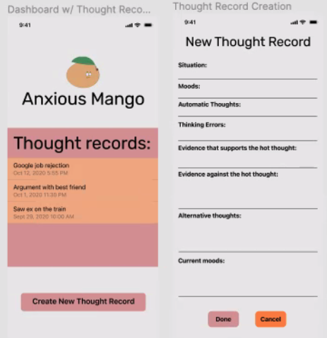

# Anxious Mango
- App is here to help everyone with their anxiety in a complicated mango world.
- Created by 
    - Monica Iqbal, https://www.linkedin.com/in/iqbalmonica/
    - Frank (Haolun) Li, https://www.linkedin.com/in/123frank/

# Initial Planning 
- [Figma document](https://www.figma.com/file/PSTPU66VNV8H60lt8YJgzI/Untitled?node-id=0%3A1)
- Virtual notebook for easy recording
- Helps build good habits and self reflection
- 

# Monica To Do 
- [x] Think about how thought logging is helpful and how it could be transformed into a digital app format.
- [X] find sheet with activities and place inside this repo
- [X] Design thought logging
    - Thought logging phases
        - [X] Dashboard where you can see thought logging
        - [X] Create a new thought log
- [ ] Make multi staged thought record logging
    - [ ] Page 1: Date, Title, Describe the situation, Mood, Automatic Thoughts
    - [ ] Page 2: Click into automatic thought, Add hot thought, Evidence for, evidence against,
    - [ ] Page 3: Click Create Balanced Thought, shows hot thought, shows moods, input box that is labled balanced thought
    - [ ] Page 4: Completed record log, plan out later
# Frank To Do
- [ ] Try to reach out to counsellors at UofT Health and Wellness or similar groups. It would be great to set up some virtual coffee chats.
    - Counsellors and professional in this field.
    - People who experience anxiety and are comfortable using an app for it.
- [ ] Talk to Troy and ask him for some ideas for logo
    
# Other Apps In Same Domain
- MySSP, way to contact and find someone to talk to.

